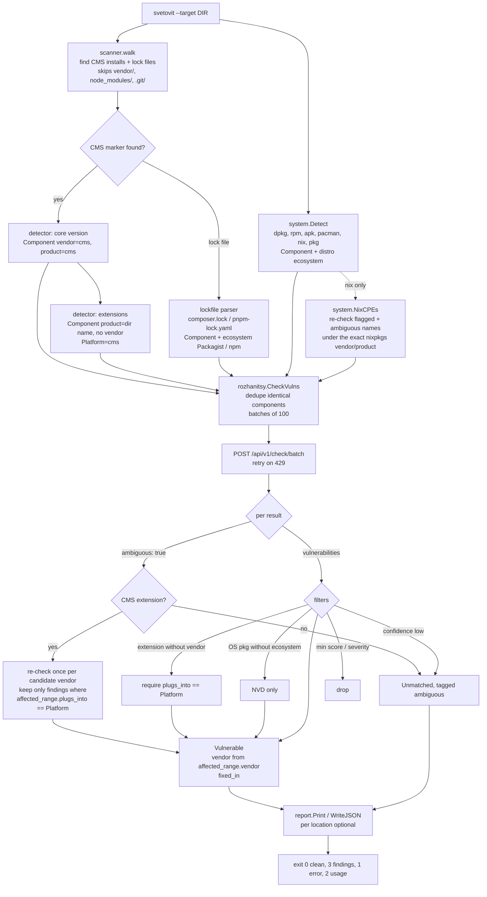

# Svetovit flow

End to end, from a directory on disk to a report. The API side is described in the
[Rozhanitsy wiki](https://github.com/TadeasDitte/rozhanitsy/wiki/API).

## Decisions worth knowing

| Situation | Behavior | Why |
|---|---|---|
| API answers `ambiguous: true` | CMS extensions are retried per candidate vendor, everything else is reported as unmatched | the API refuses to guess, a bare OS package name could belong to unrelated software |
| Extension has no vendor | a finding only counts when `plugs_into` equals the CMS | a dir name like `gallery` or `cache` otherwise matches every vendor and ecosystem that ships one |
| Vendor of a finding | `affected_range.vendor` from the check response | no extra `/vulnerabilities/{id}` lookups, which count against 60 requests/minute |
| 429 | retried, honoring `Retry-After` (max 5) | the API is throttled |
| WordPress plugin version | read from the file with a `Plugin Name:` header | a bundled library's `Version:` line in another file is not the plugin's version |
